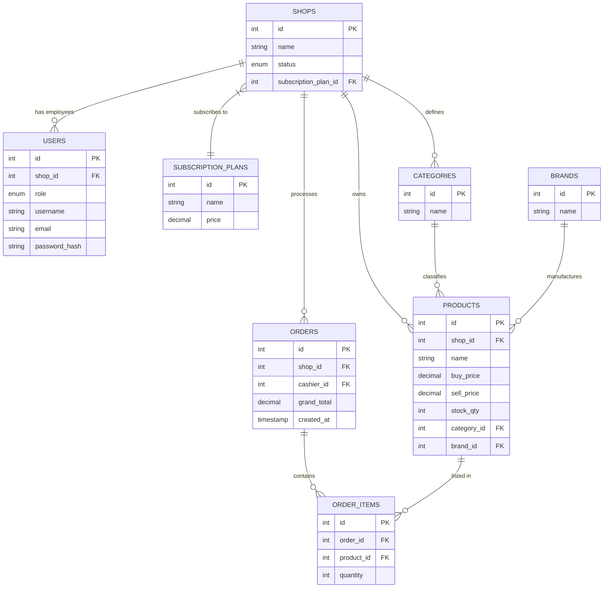
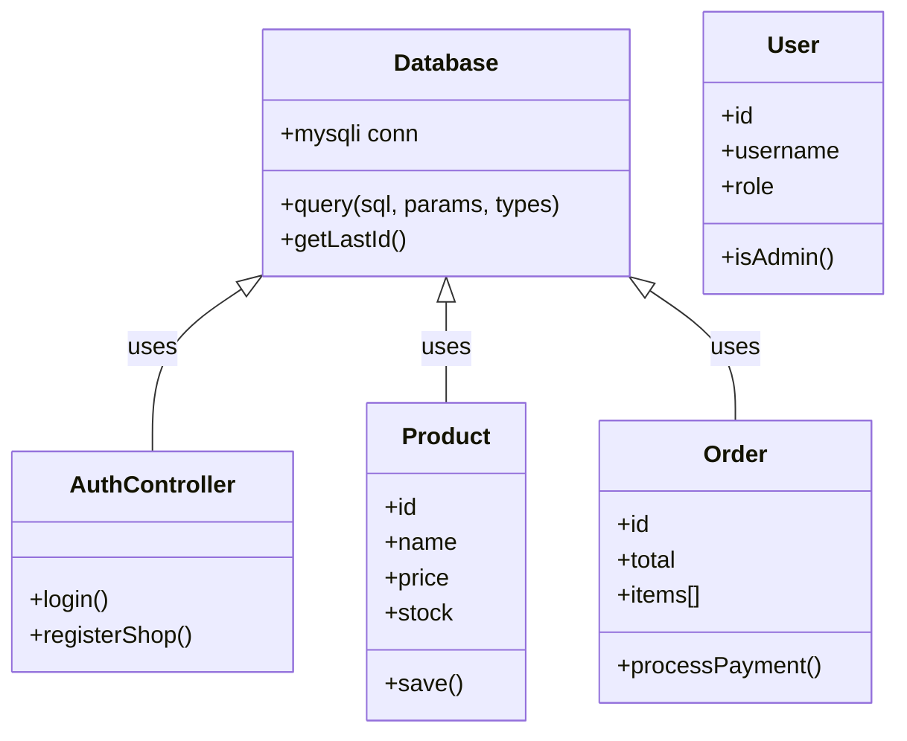

# Project Documentation

## Database Schema Diagram
The database uses a relational model with MariaDB.

## Class Diagram (Simplified PHP Structure)

Since we are using "Raw PHP" with an MVC-ish approach, there aren't many strict OOP service classes, but here is the logical structure:

## Setup Instructions
1. Import `database.sql` into MariaDB/MySQL.
2. Edit `.env` with your DB credentials.
3. Serve the project files via Apache/Nginx.
4. Login with `admin@pos.com` / `admin123`.
